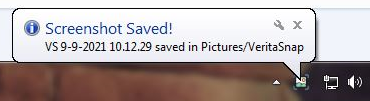
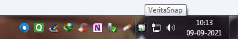

# VeritaSnap
  

A simple,no hassle screen-shot tool for windows 7.

## Download For Windows - 7:
Click [here](https://github.com/Aadityajoshi151/VeritaSnap/releases/download/v1/VeritaSnap.Setup.Win-7.exe "here") to download.

## 📝 Description:
Taking a screenshot in later versions of windows is very easy. Just use win+PrtScr and the image is saved in the pictures directory. However, this is not possible in Windows 7.
There we still have to paste the image in paint and save or use the snipping tool.

I have a friend who still uses windows 7 and faces this issue on a regular basis. His machine is not powerful enough to handle later versions of windows so he asked me for a solution. Ofcourse, the easy way is to use some existing software but what's the fun in that?

I have created this small utility that allows user to take screenshots in windows 7 with a shortcut key-combination and saves the images in pictures directory. 
According to [this](https://www.makeuseof.com/windows-7-people-are-still-using/ "this") article, people are still using windows 7 and I hope this utility will increase the productivity of some user.

## 📜 How To Use VeritaSnap:
- Simply download and install VeritaSnap on your windows 7 machine.
- There is no need to run it manually everytime. Just run the utility once from the installation wizard. It will launch automatically on every boot.
- Use **Ctrl+Shift+P** to take screenshots.
- The screenshots will be saved in **Pictures/VeritaSnap**.
- If required, you can quit VeritaSnap from the system tray.
- While uninstalling, first quit the app and then proceed.
- It's optional but after uninstalling, you can remove the VeritaSnap value from the registry editor (**HKEY_CURRENT_USER/Software/Microsoft/Windows/CurrentVersion/Run**) for a thorough uninstallation.

## 📷 Screenshots:

------------

------------

------------

## 🌱 Improvements/TODOs:
- There is a small lag when sound effect is triggered. I might remove it as the bubble notification is enough to notify the user.
- Removal of html file if not required in future.
- Making the utility more lightweight in size.
- Adding a confirm messagebox while user is quitting the utility.
- Fix a typo in installation wizard.

## 🙏 Credits:
- Icon made by [Freepik](https://www.freepik.com "Freepik") from [Flaticon](https://www.flaticon.com "Flaticon"). See it [here](https://www.flaticon.com/premium-icon/screenshot_3677242?term=screenshot&page=1&position=21&page=1&position=21&related_id=3677242 "here").
- Shutter sound effect obtained from [freesound](https://freesound.org/ "freesound"). See it [here](https://freesound.org/people/roachpowder/sounds/170229/ "here").

